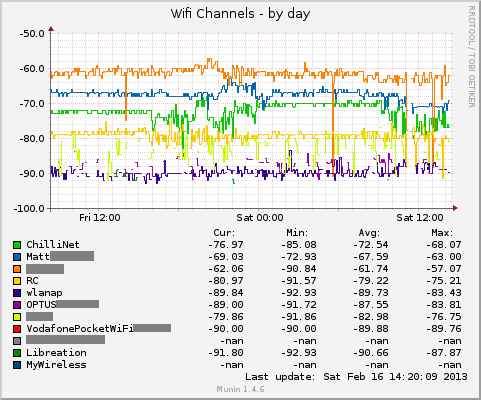
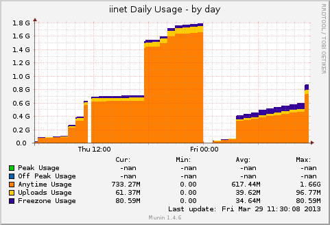
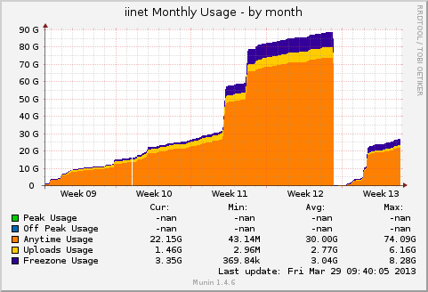

## Munin Scripts ##

All scripts are under the [Apache 2 licence](LICENCE).

### Active Wifi Channels ###

Graphs the signal strength of any active wifi channels seen by the node.

[wifi\_channels](scripts/wifi_channels)

### iinet Usage ###

Graphs the daily and monthly iinet usage.

[iinet\_daily\_usage\_guage](scripts/iinet_daily_usage_guage)

[iinet\_monthly\_usage\_guage](scripts/iinet_monthly_usage_guage)

### Online Computers ###

Graph which computers are currently online on the network.

[online\_computers](scripts/online_computers)